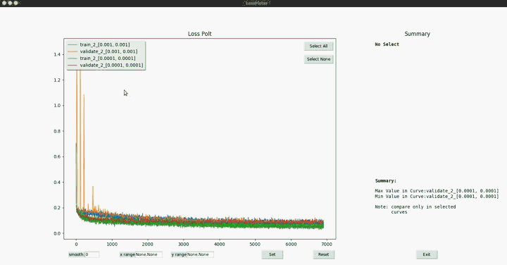
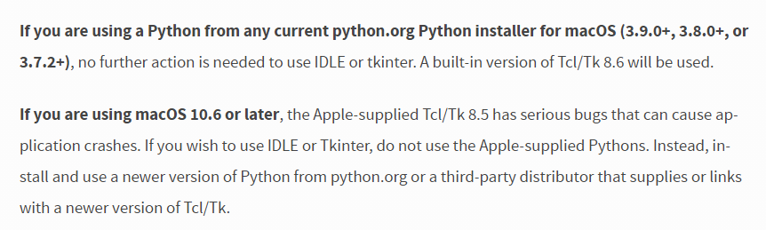

# Loss Ploter    

  

This is a offline Loss Ploter, loss record should be save in list like:  
```  
[(step_num1,value1),(step_num2,value2), ... , (step_numn,valuen)]  
```
#### Function： 
1. loss record visualize and curve info display  
2. easy compare between selected cruves  
3. cruve smooth  
4. range plot  

#### TIPS:
1. select cruves by click curve or legend(deep color means selected)  
2. single select mode can be set by 'single_select=True', defalut False  
3. compare only in selected curves  
4. Config & Curve Summary will print last click curve no matter whether it be selected   
5. tkinter is not  work in the version of python that comes with  MacOS, install new version in python.org  

