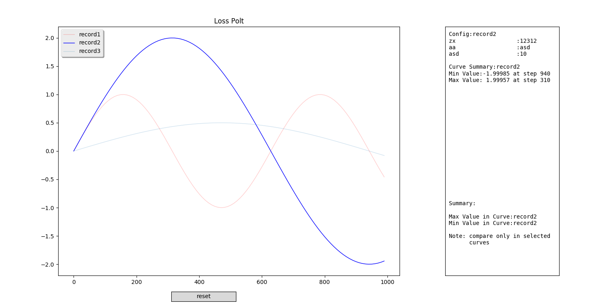

# Loss Ploter  

  

1. select cruves by click curve or legend(deep color means selected)  
2. single select mode can be set by 'single_select=True', defalut False  
3. compare only in selected curves  
4. Config & Curve Summary will print last click curve no matter whether it be selected  